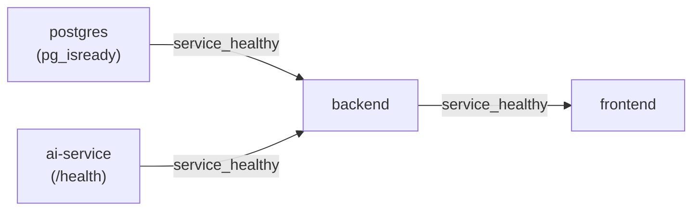

# SmartDesk Docker Containerization & Orchestration Guide

This document describes the multi-container Docker architecture, networking, persistence, and operational guidelines for the SmartDesk platform.

---

## 🏛️ Architecture & Service Topology

SmartDesk packages all application services into Docker containers interconnected by an isolated Docker bridge network:

```text
Host Machine (127.0.0.1)
  │
  ├── Port 3000 ────────> frontend (Next.js Standalone Node 26)
  │
  ├── Port 8080 ────────> backend (Spring Boot Java 26 JRE)
  │                          │
  │                          ├── internal DNS: postgres:5432
  │                          └── internal DNS: http://ai-service:8000
  │
  ├── Port 5432 ────────> postgres (PostgreSQL 17 Database)
  │                          └── Volume: smartdesk_postgres_data
  │
  └── [PRIVATE] ────────> ai-service (FastAPI Python 3.14-slim)
                             (Not exposed on host)
```

---

## 📊 Service Catalog

| Service Name | Purpose | Container Image | Container Port | Host Exposure |
| :--- | :--- | :--- | :--- | :--- |
| **`postgres`** | Relational transactional database | `postgres:17` | `5432/tcp` | `127.0.0.1:5432` |
| **`ai-service`** | ML ticket classification microservice | `smartdesk-ai:phase7.3` | `8000/tcp` | *(None - Private to Docker network)* |
| **`backend`** | Spring Boot business logic & routing | `smartdesk-backend:phase7.2` | `8080/tcp` | `127.0.0.1:8080` |
| **`frontend`** | Next.js interactive web dashboards | `smartdesk-frontend:phase7.4` | `3000/tcp` | `127.0.0.1:3000` |

---

## 🌐 Network & Port Isolation

All containers belong to the bridge network:

```yaml
networks:
  smartdesk-network:
    name: smartdesk-network
```

### Key Security & Isolation Guarantees:
1. **Loopback Binding**: Services exposed to the host (`frontend`, `backend`, `postgres`) are explicitly bound to `127.0.0.1` to prevent unwanted access from external networks.
2. **Private AI Microservice**: `ai-service` uses Docker `expose: ["8000"]` without port publishing. It is completely unreachable from the host machine and can only be invoked by internal network peers (specifically `backend`).
3. **Internal vs. External URLs**:
   - The backend reaches AI inference using `http://ai-service:8000`.
   - The backend reaches PostgreSQL using `jdbc:postgresql://postgres:5432/smartdesk`.
   - The frontend in the user's browser reaches the backend using `http://localhost:8080/api/v1` (`NEXT_PUBLIC_API_URL`).

---

## 💾 Volume Persistence & Critical Warnings

PostgreSQL data is stored in the external named volume:

```yaml
volumes:
  smartdesk_postgres_data:
    external: true
```

- **Persistence**: Container recreation (`docker compose up`, `docker compose restart`, `docker compose down`) retains all PostgreSQL data, tables, users, and tickets.
- **DDL Integrity**: Hibernate uses `spring.jpa.hibernate.ddl-auto=validate` to prevent any automated schema changes at runtime.

> [!WARNING]
> **NEVER** run `docker compose down -v`. The `-v` flag instructs Docker to delete attached volumes, permanently destroying your database.

---

## 🩺 Startup Order & Health Checks

Docker Compose ensures robust dependency ordering using container health checks:



1. **`postgres`**: Runs `pg_isready -U postgres -d smartdesk` every 3 seconds.
2. **`ai-service`**: Runs native Python script probing `http://localhost:8000/health` every 15 seconds.
3. **`backend`**: Starts only when `postgres` AND `ai-service` are healthy. It self-tests via lightweight compiled Java client probing `http://localhost:8080/actuator/health`.
4. **`frontend`**: Starts only when `backend` is healthy. Self-tests via Node HTTP probe checking `http://localhost:3000/`.

---

## ⚙️ Environment Variables

Configuration is loaded dynamically from `.env` in the repository root (see `.env.docker.example` for reference):

| Variable | Target Service | Purpose |
| :--- | :--- | :--- |
| `POSTGRES_DB` | `postgres` | Initial database name (`smartdesk`) |
| `POSTGRES_USER` | `postgres` | Database superuser username |
| `POSTGRES_PASSWORD` | `postgres` | Database password |
| `JWT_SECRET` | `backend` | Injected secret key for HMAC-SHA256 JWT signing (`${JWT_SECRET}`) |
| `DB_HOST` | `backend` | Database host name (`postgres`) |
| `DB_PORT` | `backend` | Database port (`5432`) |
| `DB_NAME` | `backend` | Database name (`smartdesk`) |
| `DB_USERNAME` | `backend` | Database login user |
| `DB_PASSWORD` | `backend` | Database login password |
| `AI_SERVICE_URL` | `backend` | Internal microservice address (`http://ai-service:8000`) |
| `AI_TIMEOUT_MS` | `backend` | Request timeout for AI categorization (e.g. `3000`) |
| `SERVER_PORT` | `backend` | Internal HTTP listening port (`8080`) |
| `CORS_ALLOWED_ORIGINS` | `backend` | Allowed web origins (`http://localhost:3000`) |
| `NEXT_PUBLIC_API_URL` | `frontend` | Browser-accessible backend API (`http://localhost:8080/api/v1`) |

---

## 🛠️ Common Docker Commands

```bash
# Start all services in detached mode
docker compose up -d

# Inspect health status across all services
docker compose ps

# Follow container logs
docker compose logs -f

# Follow logs for a specific service
docker compose logs -f backend
docker compose logs -f ai-service
docker compose logs -f frontend
docker compose logs -f postgres

# Inspect rendered compose configuration
docker compose config

# Restart services
docker compose restart

# Gracefully shut down containers (preserves database data)
docker compose down
```
