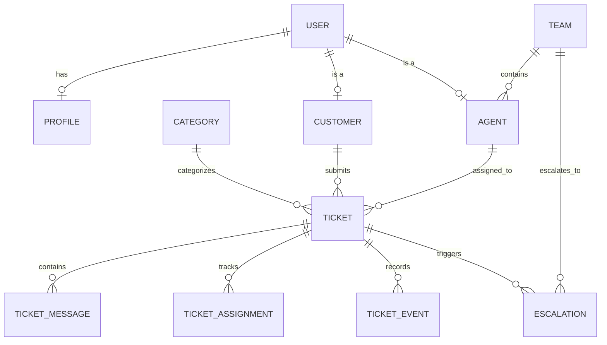

# SmartDesk Architecture Specification

## 1. Overview & System Mission

**SmartDesk** is an enterprise-grade customer support platform designed to streamline ticket ingestion, automated AI categorization, workload-balanced agent routing, and multi-tier escalation management.

### Key Objectives:
- Provide self-service ticket submission and conversational status tracking for Customers.
- Equip Support Agents with an intelligent workspace featuring automated AI categorization, customer history (Customer 360), and ticket actions.
- Provide Administrators with tools to configure routing rules, SLA policies, teams, and real-time analytics.
- Demonstrate modern software engineering, data structures and algorithms (graph escalation), relational database theory (relational algebra), and secure object-oriented patterns.

---

## 2. High-Level Architecture

SmartDesk follows a decoupled, service-oriented architecture:

```text
[ Browser Clients: Customer / Agent / Admin ]
                     |
                     | HTTPS / JSON REST APIs
                     v
+-------------------------------------------------------+
|             Java Spring Boot Application              |
|                     (Port 8080)                       |
|                                                       |
|  +--------------------+       +--------------------+  |
|  | Controllers & DTOs |       |  Spring Security   |  |
|  +---------+----------+       +---------+----------+  |
|            |                            |             |
|  +---------v----------------------------v----------+  |
|  |             Core Service Layer                  |  |
|  | - TicketService         - RoutingEngineService  |  |
|  | - EscalationGraphEngine - AiClientService       |  |
|  +---------+----------------------------+----------+  |
|            |                            |             |
|  +---------v----------+       +---------v----------+  |
|  |   Spring Data JPA  |       | HTTP Client / REST |  |
|  +---------+----------+       +---------+----------+  |
+------------|----------------------------|-------------+
             |                            |
             v                            v
+-------------------------+  +--------------------------+
|   PostgreSQL Database   |  |  Python FastAPI Service  |
|       (Port 5432)       |  |       (Port 8000)        |
| - ACID Relational Store |  | - TF-IDF Vectorizer      |
| - Audit & Event Logs    |  | - Logistic Regression    |
+-------------------------+  +--------------------------+
```

### Component Roles & Boundaries
1. **Frontend (Next.js)**:
   - Presentation layer only.
   - Communicates exclusively with the Java backend via authenticated REST endpoints.
   - Zero direct communication with the Python AI service or PostgreSQL.
2. **Primary Backend (Java Spring Boot)**:
   - Source of truth for business logic, data persistence, transactions, and security.
   - Enforces Role-Based Access Control (RBAC) and data validation.
   - Invokes the AI service synchronously during ticket ingestion.
   - Executes the routing algorithm and manages graph-based escalation.
3. **AI Classification Service (Python FastAPI)**:
   - Stateless microservice exposing high-throughput prediction endpoints.
   - Categorizes ticket subject and description using a trained ML pipeline (TF-IDF + Logistic Regression).
   - Returns predicted category, confidence score, and model metadata.
4. **Database (PostgreSQL)**:
   - Relational data persistence with strict foreign key constraints, indexes, and transactional consistency.

---

## 3. Core Database Entities & Relationships



### Entity Catalog

| Entity | Primary Purpose | Key Fields |
| :--- | :--- | :--- |
| **User** | Authentication and identity | `id`, `email`, `password_hash`, `role`, `status`, `created_at` |
| **Profile** | User personal details | `id`, `user_id`, `first_name`, `last_name`, `phone`, `avatar_url` |
| **Customer** | Customer domain entity | `id`, `user_id`, `company_name`, `account_tier` |
| **Agent** | Support agent domain entity | `id`, `user_id`, `team_id`, `skills`, `max_active_tickets` |
| **Team** | Functional support group | `id`, `name`, `tier_level` (Tier 1, Tier 2, etc.), `specialty` |
| **Category** | Ticket taxonomy | `id`, `code`, `display_name`, `description` |
| **Ticket** | Primary support unit | `id`, `ticket_number`, `customer_id`, `category_id`, `assigned_agent_id`, `team_id`, `priority`, `status`, `ai_category`, `ai_confidence` |
| **TicketMessage**| Conversation thread entry | `id`, `ticket_id`, `sender_id`, `body`, `is_internal_note`, `created_at` |
| **TicketAssignment**| History of ticket assignments | `id`, `ticket_id`, `agent_id`, `assigned_by`, `assigned_at`, `unassigned_at` |
| **TicketEvent** | Complete audit timeline | `id`, `ticket_id`, `event_type`, `actor_id`, `old_value`, `new_value`, `timestamp` |
| **Escalation** | Record of ticket tier bump | `id`, `ticket_id`, `from_team_id`, `to_team_id`, `reason`, `status`, `created_at` |
| **RoutingRule** | Automated routing criteria | `id`, `category_id`, `priority`, `target_team_id`, `is_active` |
| **EscalationRule**| Conditions triggering escalation | `id`, `trigger_type`, `threshold_minutes`, `target_team_id` |
| **SlaPolicy** | Response and resolution limits | `id`, `priority`, `response_time_minutes`, `resolution_time_minutes` |
| **Notification** | Real-time user alert | `id`, `user_id`, `title`, `message`, `is_read`, `created_at` |
| **AuditLog** | System-wide governance log | `id`, `user_id`, `action`, `resource`, `ip_address`, `timestamp` |

---

## 4. End-to-End Ticket Lifecycle & AI Classification

```text
[ Customer ]
     | 1. Submit Ticket (Subject, Description, Priority)
     v
[ Java Spring Boot Controller ]
     | 2. Validate DTO & Authenticate Customer
     | 3. POST /predict to Python FastAPI (Subject + Description)
     v
[ Python AI Service ]
     | 4. Clean text -> TF-IDF Vectorizer -> Logistic Regression Classifier
     | 5. Return: { category: "BILLING", confidence: 0.94, model_version: "v1.0" }
     v
[ Java Spring Boot Core ]
     | 6. Persist Ticket (Status: OPEN, ai_category: BILLING, ai_confidence: 0.94)
     | 7. Invoke RoutingEngineService(ticket)
     |    a. Query active RoutingRule where category == BILLING
     |    b. Locate target Team (e.g. Billing Tier 1)
     |    c. Find eligible Agents in Team with lowest active ticket workload
     |    d. Assign ticket to selected Agent (Status: IN_PROGRESS)
     | 8. Record TicketAssignment & TicketEvent audit records
     v
[ Customer & Agent Notified ]
```

---

## 5. Advanced Data Structures & Algorithms (ADSA): Graph-Based Escalation

Support organizations operate in structured, multi-tier escalation hierarchies (e.g., Tier 1 General $\rightarrow$ Tier 2 Technical $\rightarrow$ Tier 3 Engineering / Security / Billing Leads).

### Graph Representation
- **Vertices ($V$)**: Support teams or escalation levels.
- **Edges ($E$)**: Permitted, policy-compliant escalation transitions with edge weights representing SLA transition overhead.

```text
       [Tier 1 General]
        /             \
       v               v
[Tier 2 Technical]   [Tier 2 Billing]
       |                   |
       v                   v
[Tier 3 Senior Eng]   [Tier 3 Finance Lead]
       \                   /
        v                 v
       [Executive Incident Team]
```

### Algorithmic Implementations:
1. **Breadth-First Search (BFS)**:
   - Computes the shortest escalation sequence (minimum tier transitions) from any originating support unit to the target resolution team.
   - Guarantees optimal unweighted path finding.
2. **Depth-First Search (DFS)**:
   - Validates reachability across all escalation policies and detects invalid cycles (e.g. preventing recursive loops where Tier 2 re-escalates back to Tier 1 without resolution).
3. **Dijkstra's Shortest Path**:
   - Finds the lowest-latency escalation route when transitions have weighted SLA penalties.

---

## 6. Discrete Mathematics & Database Theory (DMGT / DBMS)

Relational algebra operators map directly to optimized SQL queries within SmartDesk:

### 1. Selection ($\sigma$)
*Retrieve high-priority or urgent open tickets:*
- **Relational Algebra**: $\sigma_{\text{priority} \in \{'HIGH', 'URGENT'\} \land \text{status} = 'OPEN'}(\text{Ticket})$
- **SQL**:
  ```sql
  SELECT * FROM ticket
  WHERE priority IN ('HIGH', 'URGENT') AND status = 'OPEN';
  ```

### 2. Projection ($\pi$)
*Extract ticket summary metadata for agent queue cards:*
- **Relational Algebra**: $\pi_{\text{id}, \text{ticket\_number}, \text{priority}, \text{status}, \text{created\_at}}(\text{Ticket})$
- **SQL**:
  ```sql
  SELECT id, ticket_number, priority, status, created_at
  FROM ticket;
  ```

### 3. Natural / Equi-Join ($\bowtie$)
*Correlate tickets with assigned agent names:*
- **Relational Algebra**: $\text{Ticket} \bowtie_{\text{Ticket.assigned\_agent\_id} = \text{Agent.id}} \text{Agent}$
- **SQL**:
  ```sql
  SELECT t.ticket_number, t.status, u.first_name, u.last_name
  FROM ticket t
  JOIN agent a ON t.assigned_agent_id = a.id
  JOIN users u ON a.user_id = u.id;
  ```

### 4. Selection + Join ($\sigma \circ \bowtie$)
*Find unresolved tickets assigned to Tier 1 Billing team:*
- **Relational Algebra**: $\sigma_{\text{status} \neq 'CLOSED' \land \text{team.name} = 'Tier 1 Billing'}(\text{Ticket} \bowtie \text{Team})$
- **SQL**:
  ```sql
  SELECT t.id, t.ticket_number, t.subject, tm.name AS team_name
  FROM ticket t
  JOIN team tm ON t.team_id = tm.id
  WHERE t.status != 'CLOSED' AND tm.name = 'Tier 1 Billing';
  ```

### 5. Aggregate ($\gamma$)
*Calculate average confidence and count of tickets per category:*
- **Relational Algebra**: $_{\text{category\_id}}\gamma_{\text{COUNT}(id), \text{AVG}(ai\_confidence)}(\text{Ticket})$
- **SQL**:
  ```sql
  SELECT category_id, COUNT(id) AS total_tickets, AVG(ai_confidence) AS avg_confidence
  FROM ticket
  GROUP BY category_id;
  ```

---

## 7. Object-Oriented Programming (OOPJ) Principles

1. **Encapsulation**:
   - Entities and domain models restrict direct field manipulation through private fields, getters, business methods, and immutable DTO records.
2. **Inheritance & Abstraction**:
   - `BaseEntity` providing timestamping (`created_at`, `updated_at`, `version`) and identity handling.
   - Abstract `BaseRule` extended by `RoutingRule` and `EscalationRule`.
3. **Polymorphism & Interfaces**:
   - `RoutingStrategy` interface implemented by `WorkloadBalancingRoutingStrategy`, `SkillBasedRoutingStrategy`, and `RoundRobinRoutingStrategy`.
   - `ClassifierService` interface permitting seamless swapping between the local Python FastAPI model and future LLM providers.
4. **Service-Oriented Architecture**:
   - Clear separation among Controllers, Application Services, Domain Repositories, and Infrastructure Clients.

---

## 8. Security & Governance

- **Authentication**: Stateless JWT or HttpOnly secure session cookies.
- **Role-Based Access Control (RBAC)**:
  - `CUSTOMER`: Can only access their own profile and submitted tickets.
  - `AGENT`: Can access tickets assigned to them or their assigned teams.
  - `MANAGER`: Can oversee team queues, SLA reports, and override assignments.
  - `ADMIN`: Full system configuration, user provisioning, rule customization, and audit logs.
- **Data Protection**:
  - Passwords hashed using BCrypt / Argon2.
  - Parameterized queries via Spring Data JPA prevent SQL injection.
  - Strict input validation using Jakarta Validation (`@NotNull`, `@Size`, `@Pattern`, `@Valid`).
  - Sensitive internal agent notes are filtered out from customer-facing API responses.
