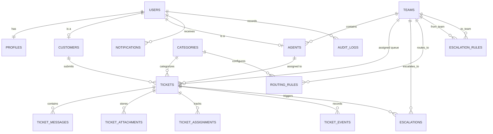

# SmartDesk Architecture Specification

## 1. Overview & System Mission

**SmartDesk** is an enterprise-grade customer support platform designed to streamline ticket ingestion, automated AI categorization, workload-balanced agent routing, and multi-tier escalation management.

### Key Objectives:
- Provide self-service ticket submission and conversational status tracking for Customers.
- Equip Support Agents with an intelligent workspace featuring automated AI categorization, customer history (Customer 360), and ticket actions.
- Provide Administrators with tools to configure routing rules, SLA policies, teams, and real-time analytics.
- Demonstrate modern software engineering, data structures and algorithms (graph escalation), relational database theory (relational algebra), and secure object-oriented patterns.

---

## 2. High-Level Architecture

SmartDesk follows a decoupled, service-oriented architecture:

```text
[ Browser Clients: Customer / Agent / Admin ]
                     |
                     | HTTPS / JSON REST APIs
                     v
+-------------------------------------------------------+
|             Java Spring Boot Application              |
|                     (Port 8080)                       |
|                                                       |
|  +--------------------+       +--------------------+  |
|  | Controllers & DTOs |       |  Spring Security   |  |
|  +---------+----------+       +---------+----------+  |
|            |                            |             |
|  +---------v----------------------------v----------+  |
|  |             Core Service Layer                  |  |
|  | - TicketService         - RoutingEngineService  |  |
|  | - EscalationGraphEngine - AiClientService       |  |
|  +---------+----------------------------+----------+  |
|            |                            |             |
|  +---------v----------+       +---------v----------+  |
|  |   Spring Data JPA  |       | HTTP Client / REST |  |
|  +---------+----------+       +---------+----------+  |
+------------|----------------------------|-------------+
             |                            |
             v                            v
+-------------------------+  +--------------------------+
|   PostgreSQL Database   |  |  Python FastAPI Service  |
|       (Port 5432)       |  |       (Port 8000)        |
| - ACID Relational Store |  | - TF-IDF Vectorizer      |
| - Audit & Event Logs    |  | - Logistic Regression    |
+-------------------------+  +--------------------------+
```

### Component Roles & Boundaries
1. **Frontend (Next.js App Router, React, TypeScript)**:
   - Presentation layer only.
   - Communicates exclusively with the Java backend via authenticated REST endpoints (`/api/v1/*` with Bearer JWT).
   - Browser client connects directly to `http://localhost:8080/api/v1`. Zero direct communication with the Python AI service or PostgreSQL.
2. **Primary Business Backend (Java Spring Boot 3+, Java 21/26)**:
   - Single authoritative source of truth for business logic, data persistence, transactions, and security.
   - Enforces Role-Based Access Control (`CUSTOMER`, `AGENT`, `ADMIN`), customer data isolation, and validation.
   - Houses the deterministic rule-based routing engine and invokes the Python AI classifier over the Docker bridge network.
   - Connects to PostgreSQL via Spring Data JPA with `spring.jpa.hibernate.ddl-auto=validate`.
3. **AI Classification Service (Python FastAPI)**:
   - Stateless microservice exposing high-throughput prediction endpoint (`POST /api/v1/classify`).
   - Categorizes ticket text using a trained scikit-learn pipeline (TF-IDF + Logistic Regression).
   - Port 8000 remains strictly private to `smartdesk-network`.
4. **Database (PostgreSQL 17)**:
   - Relational data persistence across 17 normalized tables with strict foreign key constraints, indexes, and transactional consistency.
   - Data persisted across container lifecycles in named external volume `smartdesk_postgres_data`.
5. **Orchestration (Docker Compose)**:
   - Single-command orchestration (`docker compose up -d`) with health-check-driven startup ordering.

---

## 3. Core Database Entities & Relationships

The database architecture comprises 17 fully normalized relational tables in PostgreSQL 14+:



### Entity Catalog (17 Tables)

| Entity | Primary Purpose | Key Fields |
| :--- | :--- | :--- |
| **User** (`users`) | Authentication and identity | `id` (UUID), `email`, `password_hash`, `role` (CUSTOMER, AGENT, ADMIN), `is_active` |
| **Profile** (`profiles`) | User personal contact details | `id` (UUID), `user_id` (FK 1:1), `first_name`, `last_name`, `phone`, `avatar_url` |
| **Customer** (`customers`) | Customer organization & subscription | `id` (UUID), `user_id` (FK 1:1), `customer_code`, `company_name`, `plan` |
| **Team** (`teams`) | Functional support queues | `id` (UUID), `name`, `description`, `is_active` |
| **Agent** (`agents`) | Agent operational parameters | `id` (UUID), `user_id` (FK 1:1), `team_id` (FK), `employee_code`, `availability_status`, `skills`, `max_active_tickets` |
| **Category** (`categories`) | Ticket taxonomy (9 categories) | `id` (UUID), `name` (BILLING, TECHNICAL, ACCOUNT, REFUND, SECURITY, SUBSCRIPTION, BUG, FEATURE_REQUEST, OTHER), `is_active` |
| **Ticket** (`tickets`) | Primary support operational unit | `id` (UUID), `ticket_number`, `customer_id`, `category_id`, `assigned_agent_id`, `assigned_team_id`, `subject`, `description`, `priority`, `status`, `ai_category`, `ai_confidence`, `ai_model_version` |
| **TicketMessage** (`ticket_messages`) | Conversation thread & internal staff notes | `id` (UUID), `ticket_id` (FK), `sender_user_id` (FK), `message`, `is_internal` |
| **TicketAttachment** (`ticket_attachments`) | Attached file metadata and cloud URL | `id` (UUID), `ticket_id` (FK), `message_id` (FK), `file_name`, `file_url`, `mime_type`, `file_size` |
| **TicketAssignment** (`ticket_assignments`) | Historical assignment audit trail | `id` (UUID), `ticket_id` (FK), `agent_id` (FK), `team_id` (FK), `assigned_by_user_id` (FK), `assigned_at`, `unassigned_at` |
| **TicketEvent** (`ticket_events`) | Chronological event timeline | `id` (UUID), `ticket_id` (FK), `actor_user_id` (FK), `event_type`, `old_value`, `new_value`, `metadata` (JSONB) |
| **Escalation** (`escalations`) | Multi-tier ticket escalation cases | `id` (UUID), `ticket_id` (FK), `from_team_id` (FK), `to_team_id` (FK), `from_agent_id`, `to_agent_id`, `level`, `reason`, `status` |
| **RoutingRule** (`routing_rules`) | Automated category/priority routing | `id` (UUID), `name`, `category_id` (FK), `priority`, `team_id` (FK), `priority_weight`, `is_active` |
| **EscalationRule** (`escalation_rules`) | Threshold-based escalation triggers | `id` (UUID), `name`, `from_team_id` (FK), `to_team_id` (FK), `trigger_type`, `trigger_value`, `escalation_level`, `is_active` |
| **SlaPolicy** (`sla_policies`) | Response and resolution SLA targets | `id` (UUID), `name`, `priority`, `first_response_minutes`, `resolution_minutes`, `is_active` |
| **Notification** (`notifications`) | User alert and notification feed | `id` (UUID), `user_id` (FK), `ticket_id` (FK), `type`, `title`, `message`, `is_read` |
| **AuditLog** (`audit_logs`) | System governance and security log | `id` (BIGSERIAL), `actor_user_id` (FK), `action`, `entity_type`, `entity_id`, `old_data` (JSONB), `new_data` (JSONB), `ip_address`, `user_agent` |

---

## 4. End-to-End Ticket Lifecycle & AI Classification

```text
[ Customer ]
     | 1. Submit Ticket (Subject, Description, Priority)
     v
[ Java Spring Boot Controller ]
     | 2. Validate DTO & Authenticate Customer
     | 3. POST /api/v1/classify to Python FastAPI (Subject + Description)
     v
[ Python AI Service ]
     | 4. Clean text -> TF-IDF Vectorizer -> Logistic Regression Classifier
     | 5. Return: { category: "BILLING", confidence: 0.94, model_version: "ticket-classifier-v1" }
     v
[ Java Spring Boot Core ]
     | 6. Persist Ticket (Status: OPEN, ai_category: BILLING, ai_confidence: 0.94)
     | 7. Invoke RoutingEngineService(ticket)
     |    a. Query active RoutingRule where category == BILLING
     |    b. Locate target Team (e.g. Billing Tier 1)
     |    c. Find eligible Agents in Team with lowest active ticket workload
     |    d. Assign ticket to selected Agent (Status: IN_PROGRESS)
     | 8. Record TicketAssignment & TicketEvent audit records
     v
[ Customer & Agent Notified ]
```

---

## 5. Advanced Data Structures & Algorithms (ADSA): Graph-Based Escalation

Support organizations operate in structured, multi-tier escalation hierarchies (e.g., Tier 1 General $\rightarrow$ Tier 2 Technical $\rightarrow$ Tier 3 Engineering / Security / Billing Leads).

### Graph Representation
- **Vertices ($V$)**: Support teams or escalation levels.
- **Edges ($E$)**: Permitted, policy-compliant escalation transitions with edge weights representing SLA transition overhead.

```text
       [Tier 1 General]
        /             \
       v               v
[Tier 2 Technical]   [Tier 2 Billing]
       |                   |
       v                   v
[Tier 3 Senior Eng]   [Tier 3 Finance Lead]
       \                   /
        v                 v
       [Executive Incident Team]
```

### Algorithmic Implementations:
1. **Breadth-First Search (BFS)**:
   - Computes the shortest escalation sequence (minimum tier transitions) from any originating support unit to the target resolution team.
   - Guarantees optimal unweighted path finding.
2. **Depth-First Search (DFS)**:
   - Validates reachability across all escalation policies and detects invalid cycles (e.g. preventing recursive loops where Tier 2 re-escalates back to Tier 1 without resolution).
3. **Dijkstra's Shortest Path**:
   - Finds the lowest-latency escalation route when transitions have weighted SLA penalties.

---

## 6. Discrete Mathematics & Database Theory (DMGT / DBMS)

Relational algebra operators map directly to optimized SQL queries within SmartDesk:

### 1. Selection ($\sigma$)
*Retrieve high-priority or urgent open tickets:*
- **Relational Algebra**: $\sigma_{\text{priority} \in \{'HIGH', 'URGENT'\} \land \text{status} = 'OPEN'}(\text{Ticket})$
- **SQL**:
  ```sql
  SELECT * FROM ticket
  WHERE priority IN ('HIGH', 'URGENT') AND status = 'OPEN';
  ```

### 2. Projection ($\pi$)
*Extract ticket summary metadata for agent queue cards:*
- **Relational Algebra**: $\pi_{\text{id}, \text{ticket\_number}, \text{priority}, \text{status}, \text{created\_at}}(\text{Ticket})$
- **SQL**:
  ```sql
  SELECT id, ticket_number, priority, status, created_at
  FROM ticket;
  ```

### 3. Natural / Equi-Join ($\bowtie$)
*Correlate tickets with assigned agent names:*
- **Relational Algebra**: $\text{Ticket} \bowtie_{\text{Ticket.assigned\_agent\_id} = \text{Agent.id}} \text{Agent}$
- **SQL**:
  ```sql
  SELECT t.ticket_number, t.status, u.first_name, u.last_name
  FROM ticket t
  JOIN agent a ON t.assigned_agent_id = a.id
  JOIN users u ON a.user_id = u.id;
  ```

### 4. Selection + Join ($\sigma \circ \bowtie$)
*Find unresolved tickets assigned to Tier 1 Billing team:*
- **Relational Algebra**: $\sigma_{\text{status} \neq 'CLOSED' \land \text{team.name} = 'Tier 1 Billing'}(\text{Ticket} \bowtie \text{Team})$
- **SQL**:
  ```sql
  SELECT t.id, t.ticket_number, t.subject, tm.name AS team_name
  FROM ticket t
  JOIN team tm ON t.team_id = tm.id
  WHERE t.status != 'CLOSED' AND tm.name = 'Tier 1 Billing';
  ```

### 5. Aggregate ($\gamma$)
*Calculate average confidence and count of tickets per category:*
- **Relational Algebra**: $_{\text{category\_id}}\gamma_{\text{COUNT}(id), \text{AVG}(ai\_confidence)}(\text{Ticket})$
- **SQL**:
  ```sql
  SELECT category_id, COUNT(id) AS total_tickets, AVG(ai_confidence) AS avg_confidence
  FROM ticket
  GROUP BY category_id;
  ```

---

## 7. Object-Oriented Programming (OOPJ) Principles

1. **Encapsulation**:
   - Entities and domain models restrict direct field manipulation through private fields, getters, business methods, and immutable DTO records.
2. **Inheritance & Abstraction**:
   - `BaseEntity` providing timestamping (`created_at`, `updated_at`, `version`) and identity handling.
   - Abstract `BaseRule` extended by `RoutingRule` and `EscalationRule`.
3. **Polymorphism & Interfaces**:
   - `RoutingStrategy` interface implemented by `WorkloadBalancingRoutingStrategy`, `SkillBasedRoutingStrategy`, and `RoundRobinRoutingStrategy`.
   - `ClassifierService` interface permitting seamless swapping between the local Python FastAPI model and future LLM providers.
4. **Service-Oriented Architecture**:
   - Clear separation among Controllers, Application Services, Domain Repositories, and Infrastructure Clients.

---

## 8. Security & Governance

- **Authentication**: Stateless JWT or HttpOnly secure session cookies.
- **Role-Based Access Control (RBAC)**:
  - `CUSTOMER`: Can only access their own profile and submitted tickets.
  - `AGENT`: Can access tickets assigned to them or their assigned teams and inspect AI advisory metadata.
  - `ADMIN`: Full system configuration, user provisioning, rule customization, operational analytics, and audit logs.
- **Data Protection**:
  - Passwords hashed using BCrypt / Argon2.
  - Parameterized queries via Spring Data JPA prevent SQL injection.
  - Strict input validation using Jakarta Validation (`@NotNull`, `@Size`, `@Pattern`, `@Valid`).
  - Sensitive internal agent notes are filtered out from customer-facing API responses.
