# SmartDesk Entity Relationship (ER) Diagram

This document presents the complete relational database model for the **SmartDesk** platform, covering all 17 core entities, cardinalities, primary/foreign keys, and integrity constraints.

---

## 1. Complete Mermaid ER Diagram

```mermaid
erDiagram
    %% =========================================================================
    %% ENTITY DEFINITIONS WITH ATTRIBUTES AND KEYS
    %% =========================================================================

    USERS {
        uuid id PK
        varchar email UK
        varchar password_hash
        varchar role "CHECK: CUSTOMER, AGENT, ADMIN"
        boolean is_active
        timestamptz created_at
        timestamptz updated_at
    }

    PROFILES {
        uuid id PK
        uuid user_id FK,UK "1:1 with users"
        varchar first_name
        varchar last_name
        varchar phone
        text avatar_url
        timestamptz created_at
        timestamptz updated_at
    }

    CUSTOMERS {
        uuid id PK
        uuid user_id FK,UK "1:1 with users"
        varchar customer_code UK
        varchar company_name
        varchar plan
        timestamptz joined_at
        timestamptz created_at
        timestamptz updated_at
    }

    TEAMS {
        uuid id PK
        varchar name UK
        text description
        boolean is_active
        timestamptz created_at
        timestamptz updated_at
    }

    AGENTS {
        uuid id PK
        uuid user_id FK,UK "1:1 with users"
        uuid team_id FK "nullable"
        varchar employee_code UK
        varchar availability_status "AVAILABLE, BUSY, OFFLINE"
        text skills
        int max_active_tickets
        timestamptz created_at
        timestamptz updated_at
    }

    CATEGORIES {
        uuid id PK
        varchar name UK "BILLING, TECHNICAL, etc."
        text description
        boolean is_active
        timestamptz created_at
        timestamptz updated_at
    }

    TICKETS {
        uuid id PK
        varchar ticket_number UK
        uuid customer_id FK "RESTRICT delete"
        uuid category_id FK "SET NULL delete"
        uuid assigned_agent_id FK "SET NULL delete"
        uuid assigned_team_id FK "SET NULL delete"
        varchar subject
        text description
        varchar priority "LOW, MEDIUM, HIGH, URGENT"
        varchar status "OPEN, IN_PROGRESS, etc."
        varchar ai_category
        numeric ai_confidence "0.0000 - 1.0000"
        varchar ai_model_version
        timestamptz created_at
        timestamptz updated_at
        timestamptz resolved_at
        timestamptz closed_at
    }

    TICKET_MESSAGES {
        uuid id PK
        uuid ticket_id FK "CASCADE delete"
        uuid sender_user_id FK "RESTRICT delete"
        text message
        boolean is_internal "Private staff notes"
        timestamptz created_at
        timestamptz updated_at
    }

    TICKET_ATTACHMENTS {
        uuid id PK
        uuid ticket_id FK "CASCADE delete"
        uuid message_id FK "nullable, SET NULL delete"
        varchar file_name
        text file_url
        varchar mime_type
        bigint file_size
        timestamptz created_at
    }

    TICKET_ASSIGNMENTS {
        uuid id PK
        uuid ticket_id FK "CASCADE delete"
        uuid agent_id FK "SET NULL delete"
        uuid team_id FK "SET NULL delete"
        uuid assigned_by_user_id FK "RESTRICT delete"
        text assignment_reason
        timestamptz assigned_at
        timestamptz unassigned_at
    }

    TICKET_EVENTS {
        uuid id PK
        uuid ticket_id FK "CASCADE delete"
        uuid actor_user_id FK "SET NULL delete"
        varchar event_type "TICKET_CREATED, STATUS_CHANGED, etc."
        text old_value
        text new_value
        jsonb metadata
        timestamptz created_at
    }

    ESCALATIONS {
        uuid id PK
        uuid ticket_id FK "CASCADE delete"
        uuid from_team_id FK "SET NULL delete"
        uuid to_team_id FK "RESTRICT delete"
        uuid from_agent_id FK "SET NULL delete"
        uuid to_agent_id FK "SET NULL delete"
        int level ">= 1"
        text reason
        varchar status "OPEN, IN_PROGRESS, RESOLVED, CANCELLED"
        timestamptz created_at
        timestamptz resolved_at
    }

    ROUTING_RULES {
        uuid id PK
        varchar name UK
        uuid category_id FK "CASCADE delete"
        varchar priority "nullable"
        uuid team_id FK "CASCADE delete"
        int priority_weight
        boolean is_active
        timestamptz created_at
        timestamptz updated_at
    }

    ESCALATION_RULES {
        uuid id PK
        varchar name UK
        uuid from_team_id FK "CASCADE delete"
        uuid to_team_id FK "CASCADE delete"
        varchar trigger_type "TIME, PRIORITY, STATUS, MANUAL"
        varchar trigger_value
        int escalation_level
        boolean is_active
        timestamptz created_at
        timestamptz updated_at
    }

    SLA_POLICIES {
        uuid id PK
        varchar name UK
        varchar priority UK "LOW, MEDIUM, HIGH, URGENT"
        int first_response_minutes
        int resolution_minutes
        boolean is_active
        timestamptz created_at
        timestamptz updated_at
    }

    NOTIFICATIONS {
        uuid id PK
        uuid user_id FK "CASCADE delete"
        uuid ticket_id FK "SET NULL delete"
        varchar type
        varchar title
        text message
        boolean is_read
        timestamptz created_at
        timestamptz read_at
    }

    AUDIT_LOGS {
        bigserial id PK
        uuid actor_user_id FK "SET NULL delete"
        varchar action
        varchar entity_type
        varchar entity_id
        jsonb old_data
        jsonb new_data
        varchar ip_address
        text user_agent
        timestamptz created_at
    }

    %% =========================================================================
    %% RELATIONSHIP DEFINITIONS & CARDINALITIES
    %% =========================================================================

    %% Identity & Subtypes (1-to-1)
    USERS ||--|| PROFILES : "has personal profile"
    USERS ||--o| CUSTOMERS : "extends as customer"
    USERS ||--o| AGENTS : "extends as agent"

    %% Organization & Team Structure
    TEAMS ||--o{ AGENTS : "employs"
    TEAMS ||--o{ TICKETS : "assigned team queue"
    TEAMS ||--o{ ROUTING_RULES : "target team for rule"
    TEAMS ||--o{ ESCALATION_RULES : "source team for rule"
    TEAMS ||--o{ ESCALATION_RULES : "destination team for rule"
    TEAMS ||--o{ ESCALATIONS : "source team"
    TEAMS ||--o{ ESCALATIONS : "destination team"

    %% Category Relations
    CATEGORIES ||--o{ TICKETS : "classifies"
    CATEGORIES ||--o{ ROUTING_RULES : "triggers routing"

    %% Customer & Agent to Ticket Relations
    CUSTOMERS ||--o{ TICKETS : "submits"
    AGENTS ||--o{ TICKETS : "handles"

    %% Ticket Sub-Entities (Lifecycles & Details)
    TICKETS ||--o{ TICKET_MESSAGES : "contains conversation"
    TICKETS ||--o{ TICKET_ATTACHMENTS : "stores files"
    TICKET_MESSAGES ||--o{ TICKET_ATTACHMENTS : "attached to note"
    TICKETS ||--o{ TICKET_ASSIGNMENTS : "tracks movement"
    TICKETS ||--o{ TICKET_EVENTS : "records lifecycle history"
    TICKETS ||--o{ ESCALATIONS : "triggers escalation workflow"
    TICKETS ||--o{ NOTIFICATIONS : "generates alerts"

    %% User interactions with Ticket Entities
    USERS ||--o{ TICKET_MESSAGES : "authors"
    USERS ||--o{ TICKET_ASSIGNMENTS : "performed by user"
    USERS ||--o{ TICKET_EVENTS : "acted by user"
    USERS ||--o{ NOTIFICATIONS : "receives"
    USERS ||--o{ AUDIT_LOGS : "performs action"
```

---

## 2. Cardinality & Foreign Key Behavior Matrix

| Relationship | Parent Table | Child Table | Cardinality | FK Column | On Delete | Business Rationale |
|---|---|---|---|---|---|---|
| User Profile | `users` | `profiles` | 1:1 | `user_id` | `CASCADE` | Deleting a user must clean up personal PII. |
| Customer Subtype | `users` | `customers` | 1:0..1 | `user_id` | `CASCADE` | Deleting a user removes customer profile. |
| Agent Subtype | `users` | `agents` | 1:0..1 | `user_id` | `CASCADE` | Deleting an agent user removes agent profile. |
| Agent Team | `teams` | `agents` | 1:0..N | `team_id` | `SET NULL` | Disbanding a team does not delete the agents. |
| Ticket Customer | `customers` | `tickets` | 1:0..N | `customer_id` | `RESTRICT` | Cannot delete customer with existing support tickets. |
| Ticket Category | `categories` | `tickets` | 1:0..N | `category_id` | `SET NULL` | Retiring a category preserves existing tickets. |
| Ticket Agent | `agents` | `tickets` | 1:0..N | `assigned_agent_id` | `SET NULL` | Reassigning/deleting an agent returns ticket to unassigned. |
| Ticket Team | `teams` | `tickets` | 1:0..N | `assigned_team_id` | `SET NULL` | Retiring team unassigns team queue. |
| Ticket Messages | `tickets` | `ticket_messages` | 1:0..N | `ticket_id` | `CASCADE` | Deleting a test ticket purges thread. |
| Message Author | `users` | `ticket_messages` | 1:0..N | `sender_user_id` | `RESTRICT` | User account cannot be deleted while authoring messages. |
| Attachments | `tickets` | `ticket_attachments`| 1:0..N | `ticket_id` | `CASCADE` | Purging ticket removes attachment metadata. |
| Event Timeline | `tickets` | `ticket_events` | 1:0..N | `ticket_id` | `CASCADE` | Ticket lifecycle logs belong to ticket container. |
| Escalation Link | `tickets` | `escalations` | 1:0..N | `ticket_id` | `CASCADE` | Escalation case belongs to ticket container. |
| Notifications | `users` | `notifications` | 1:0..N | `user_id` | `CASCADE` | User account deletion purges inbox notifications. |
| Audit Trail | `users` | `audit_logs` | 1:0..N | `actor_user_id` | `SET NULL` | System audit logs must persist even if actor is removed. |
