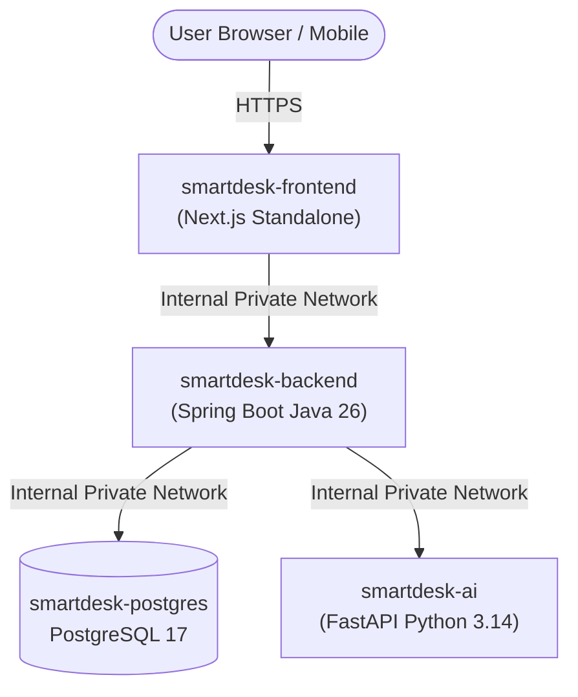

# SmartDesk Render Deployment Guide

This comprehensive guide covers deploying **SmartDesk** (PostgreSQL, Python AI Service, Java Spring Boot Backend, and Next.js Frontend) to **[Render](https://render.com/)**.

---

## 1. Architecture Overview on Render

When deployed to Render, your SmartDesk stack runs as follows:



- **Database**: Managed PostgreSQL on Render.
- **smartdesk-ai**: Python FastAPI container exposing ticket classification, sentiment analysis, and duplicate detection.
- **smartdesk-backend**: Java 26 container running Spring Boot with container-aware JVM ergonomics (`-XX:MaxRAMPercentage=75.0`).
- **smartdesk-frontend**: Next.js 16 container running in standalone production mode with internal API reverse-proxying.

---

## 2. Deploying with Render Blueprint (Recommended)

SmartDesk includes a pre-configured `render.yaml` Blueprint file at the repository root. This allows you to deploy the entire stack in one click.

### Step 1: Push your latest changes to GitHub
Ensure your local branch is committed and pushed:
```bash
git add .
git commit -m "Configure Render blueprint and deployment support"
git push origin main
```

### Step 2: Open Render and Create Blueprint
1. Log in to [dashboard.render.com](https://dashboard.render.com/).
2. Click the **New +** button in the top navigation bar.
3. Select **Blueprint**.
4. Connect your GitHub repository (`nagasripadala2107-git/smart-desk`).
5. Render will automatically detect `render.yaml` and display the 4 resources to be created:
   - `smartdesk-postgres` (Database)
   - `smartdesk-ai` (Web Service)
   - `smartdesk-backend` (Web Service)
   - `smartdesk-frontend` (Web Service)
6. Click **Apply**. Render will begin provisioning all resources.

---

## 3. Database Initialization (Required Once)

When Render provisions your fresh PostgreSQL instance, it is completely empty. You must apply the database schema and seed data.

SmartDesk provides a consolidated script: `database/init_all.sql`.

### Option A: Using Render's Web Shell / PSQL (Easiest)
1. On your Render Dashboard, click on **smartdesk-postgres**.
2. Go to the **Connect** tab.
3. Under **PSQL Command**, copy the command, for example:
   ```bash
   PGPASSWORD=xxxx psql -h dpg-xxxx-a.oregon-postgres.render.com -U postgres smartdesk
   ```
4. Run that command in your local terminal (or PowerShell) with input redirection:
   ```bash
   # From your project root directory:
   PGPASSWORD=xxxx psql -h dpg-xxxx-a.oregon-postgres.render.com -U postgres smartdesk < database/init_all.sql
   ```

### Option B: Using DBeaver / pgAdmin / GUI
1. On your Render Dashboard, click **smartdesk-postgres**.
2. Copy the **External Database URL**.
3. Open **DBeaver** or **pgAdmin**, create a new PostgreSQL connection, and paste the URL.
4. Open the SQL editor, open `database/init_all.sql`, and execute the script.

This creates all 17 tables, foreign key constraints, indexes, triggers, categories, SLA policies, routing rules, and demo accounts.

---

## 4. Default Demo Accounts

Once initialized, the baseline accounts are ready to sign in (default password: `Password123!`):

| Role | Email | Password | Dashboard Route |
| :--- | :--- | :--- | :--- |
| **System Administrator** | `admin@smartdesk.local` | `Password123!` | `/admin/dashboard` |
| **Support Agent** | `agent.tech@smartdesk.local` | `Password123!` | `/agent/dashboard` |
| **Customer** | `alex@acmecorp.local` | `Password123!` | `/customer/dashboard` |

---

## 5. Health Check Verification

Once services display **Live** in Render:

1. **Frontend**: Open `https://smartdesk-frontend-xxxx.onrender.com` in your browser.
2. **Backend Health**: Visit `https://smartdesk-backend-xxxx.onrender.com/actuator/health` (should return `{"status":"UP"}`).
3. **AI Service Health**: Visit `https://smartdesk-ai-xxxx.onrender.com/health` (should return `{"status":"healthy"}`).

---

## 6. Manual Setup (Alternative to Blueprint)

If you prefer to configure services individually in the Render UI:

### 1. PostgreSQL Database
- **Name**: `smartdesk-postgres`
- **Database**: `smartdesk`
- **User**: `postgres`
- **Plan**: `Free`

### 2. AI Microservice
- **Name**: `smartdesk-ai`
- **Runtime**: `Docker`
- **Root Directory**: `ai-service`
- **Dockerfile Path**: `Dockerfile`
- **Plan**: `Free`
- **Health Check Path**: `/health`

### 3. Backend Service
- **Name**: `smartdesk-backend`
- **Runtime**: `Docker`
- **Root Directory**: `backend-java`
- **Dockerfile Path**: `Dockerfile`
- **Plan**: `Free`
- **Health Check Path**: `/actuator/health`
- **Environment Variables**:
  - `SPRING_PROFILES_ACTIVE`: `prod`
  - `PORT`: `8080`
  - `DB_HOST`: `<Database Internal Host>`
  - `DB_PORT`: `5432`
  - `DB_NAME`: `smartdesk`
  - `DB_USERNAME`: `postgres`
  - `DB_PASSWORD`: `<Database Password>`
  - `AI_SERVICE_URL`: `http://smartdesk-ai:8000`
  - `JWT_SECRET`: `<64-character random string>`
  - `HIBERNATE_DDL_AUTO`: `validate`
  - `CORS_ALLOWED_ORIGINS`: `*`

### 4. Frontend Service
- **Name**: `smartdesk-frontend`
- **Runtime**: `Docker`
- **Root Directory**: `frontend`
- **Dockerfile Path**: `Dockerfile`
- **Plan**: `Free`
- **Environment Variables**:
  - `NODE_ENV`: `production`
  - `PORT`: `3000`
  - `INTERNAL_BACKEND_URL`: `http://smartdesk-backend:8080`

---

## 7. Render Free Tier Considerations

- **Inactivity Sleep**: Free Web Services spin down after 15 minutes of inactivity. When a new request arrives, it may take 30–50 seconds to wake up (cold start).
- **PostgreSQL Expiration**: Free PostgreSQL databases on Render expire after 30 days. For persistent production use, upgrade to the Render Starter plan ($7/mo) or connect an external managed database (e.g., Supabase, Neon, AWS RDS).
- **Memory Optimization**: The backend Java container is pre-configured with `-XX:MaxRAMPercentage=75.0` to operate safely within Render's 512 MB memory boundary.
